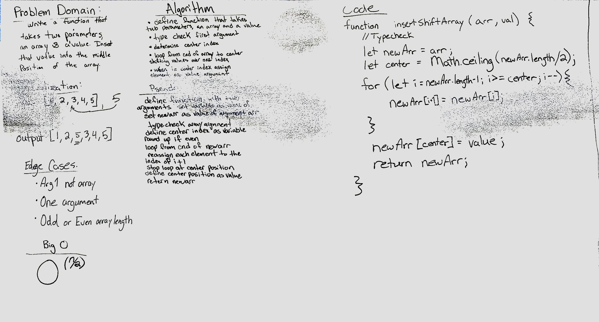

# Insert and shift middle index of array
<!-- Short summary or background information -->

## Challenge
<!-- Description of the challenge -->
the challenge was to write a function with two parameters. An input array and a value. The function should take the input value and insert that in to the middle position of the given array. return new array without alering the origin input array

## Approach & Efficiency
<!-- What approach did you take? Why? What is the Big O space/time for this approach? -->
In our solution we looped backwards from the end of the input array shifting the elements over by one position once i = the index of the center position stop the loop and assign the value of the element as the input value.

## Solution
<!-- Embedded whiteboard image -->

